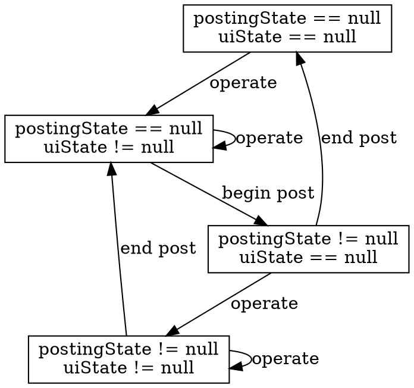

# syncedState,postingState,uiState

## 各 state の解説

### syncedState

API サーバーにおける state。どの revision の state でも良いが、外部で常に最新の state を取得し、syncedState に代入されることを想定している。syncedState は常に存在する。

### postingState

API サーバーに変更を送信したときの state。API サーバーの応答待ちのときのみに用いる。

### uiState

クライアントの画面に表示する state。いつか API サーバーに送信する予定だが、まだ送信していないときのみに用いる。

## 状態遷移図

-   operate: ユーザーによる state の変更の要求
-   begin post: API サーバーに operation を送信し、応答待ちの状態に入る
-   end post: API サーバーから応答を受け取る
